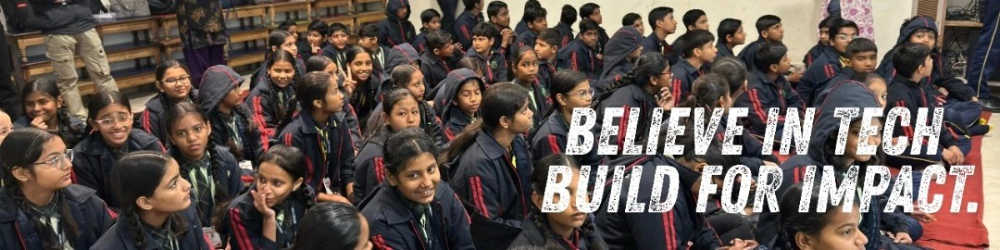

<h1>Hi 👋, I'm Rishi</h1>

 

💼 CSE @ MNIT Jaipur  •  🚀 Co-Founder @ CONSOLE  •  📍 Jaipur, India

 

---

### 🛠️ Tech Stack

---

### 📊 GitHub Metrics

  

  

  

---

### 🐍 Contribution Graph

---

### 🌐 Connect

 

  

